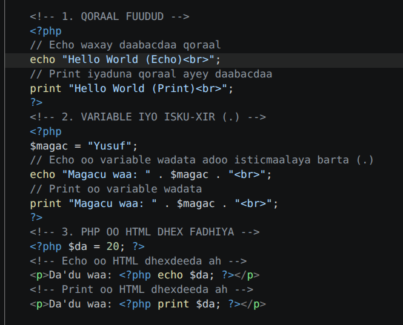
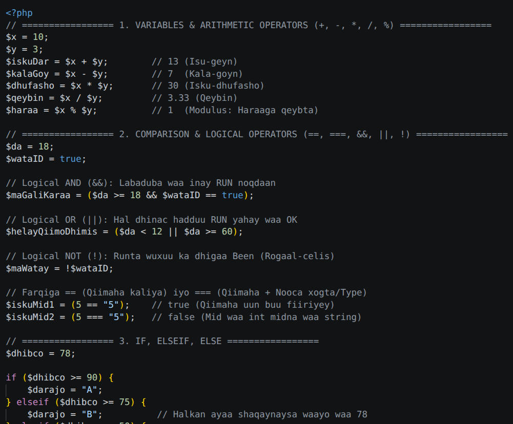
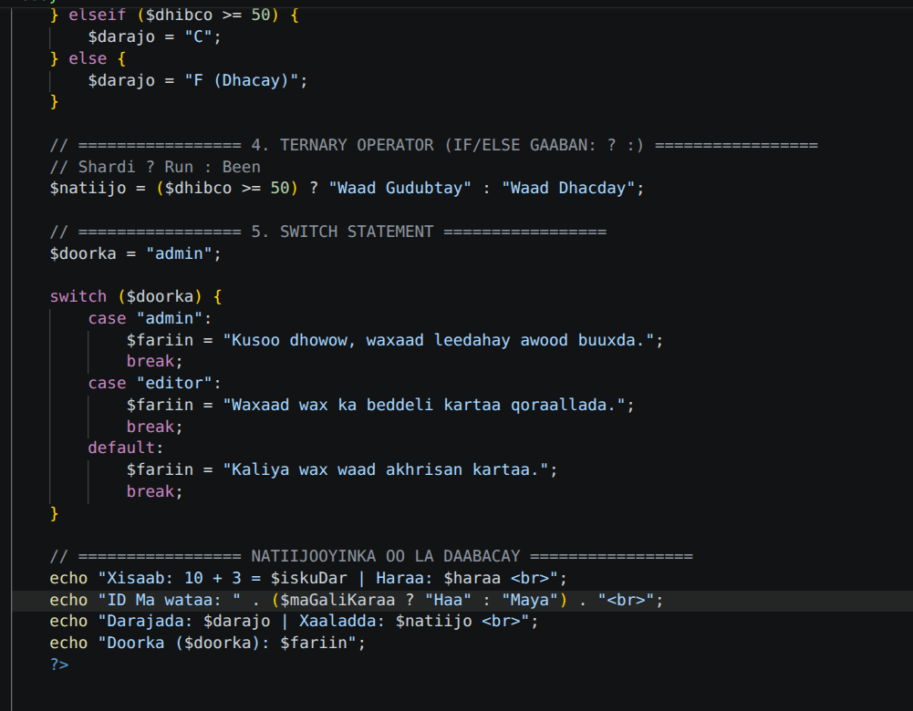

# 🐘 Barashada & Practice-ka PHP

Waa Practice ka Week1

---

## 📸 Qaybta 1: Aasaaska Echo, Print & Variables

Sawirkan kore (**1.png**) wuxuu muujinayaa saddex dariiqo oo aasaasi ah oo loo adeegsado PHP:

### 1. Qoraal Fudud (Basic Output)
Qeybtan waxaan ku baranaynaa sida qoraal caadi ah shaashadda loogu soo saaro iyadoo la adeegsanayo `echo` iyo `print`:

* **`echo "Hello World (Echo) ";`**  
  Waxay soo daabacaysaa qoraalka `"Hello World (Echo)"`, calaamadda ` `-na waxay qoraalka xiga u daadajinaysaa khadka hoose.
* **`print "Hello World (Print) ";`**  
  Waxay qabanaysaa isla shaqadii `echo` oo kale, iyaduna qoraal ayey soo bandhigaysaa.

---

### 2. Variable iyo Isku-xirka Qoraalka (Concatenation)
Qeybtan waxaan ku arkaynaa sida loo abuuro doorsoome (variable) iyo sida qoraal caadi ah loogu xiro:

* **`$magac = "Yusuf";`**  
  Waxaan abuurnay variable magaciisu yahay `$magac` oo xambaarsan xogta qoraalka ah ee `"Yusuf"`.
* **`echo "Magacu waa: " . $magac . " ";`**  
  Waxaan isticmaalnay **barta (`.`)** si aan isugu xirno qoraalka `"Magacu waa: "` iyo qiimaha ku jira variable-ka (`Yusuf`).
* **`print "Magacu waa: " . $magac . " ";`**  
  Sidoo kale, `print` waxay adeegsanaysaa barta (`.`) si ay isugu xirto qoraalka iyo variable-ka.

---

### 3. PHP oo HTML Dhex Fadhiya (Inline PHP)
Qeybtan waxay sharxaysaa sida PHP loogu dhex daro summado HTML ah (HTML Tags):

* **`<?php $da = 20; ?>`**  
  Waxaa la abuuray variable lambar ah (`20`) inta aan HTML-ka la gaarin.
* **`
Da'du waa: <?php echo $da; ?>
`**  
  Waxaan dhex fariisinnay `<?php echo $da; ?>` gudaha tag-ga `
` ee HTML, si natiijada PHP ay si toos ah ugu dhex dhalato baaragaraafka HTML-ka.
* **`
Da'du waa: <?php print $da; ?>
`**  
  Waa isla habkii kore, waxaana lagu dhex isticmaalay `print` gudaha tag-ga `
`.

---

## 📸 Qaybta 2: Operators & Logic (Xisaabta & Shuruudaha Bilowga ah)

Sawirkan labaad (**2.png**) wuxuu diiradda saarayaa xisaabta, shuruudaha macquulka ah (logical operators), iyo bilowga qaybta go'aannada (`if`):

### 1. Xisaabta Aasaasiga ah (Arithmetic Operators)
* **`+` (Isu-geyn):** `$x + $y` wuxuu isu geeyay 10 iyo 3 (Natiijo: `13`).
* **`-` (Kala-goyn):** `$x - $y` wuxuu 3 ka gooyay 10 (Natiijo: `7`).
* **`*` (Isku-dhufasho):** `$x * $y` wuxuu isku dhuftay 10 iyo 3 (Natiijo: `30`).
* **`/` (Qeybin):** `$x / $y` wuxuu 10 u qeybiyay 3 (Natiijo: `3.33`).
* **`%` (Modulus):** `$x % $y` wuxuu soo saarayaa haraaga marka 10 loo qeybiyo 3 (Natiijo: `1`).

---

### 2. Shuruudaha Macquulka ah (Comparison & Logical Operators)
* **`&&` (Logical AND):** Labada shardi waa inay labaduba run noqdaan si natiijadu u noqoto run (`$da >= 18 && $wataID == true`).
* **`||` (Logical OR):** Ugu yaraan hal dhinac hadduu shardi ahaan sax noqdo waa ku filan yahay (`$da < 12 || $da >= 60`).
* **`!` (Logical NOT):** Rogaal-celis; haddii wax sax yihiin been buu ka dhigaa, hadday been yihiinna sax (`!$wataID`).
* **`==` vs `===`:**
  * **`==` (Equal):** Waxay is-barbardhigtaa qiimaha kaliya (`5 == "5"` waa **true**).
  * **`===` (Identical):** Waxay eegtaa qiimaha **iyo** nooca xogta (data type). (`5 === "5"` waa **false** waayo mid waa *Integer*, midna waa *String*).

---

## 📸 Qaybta 3: Go'aannada (If-Else, Ternary & Switch)

Sawirkan saddexaad (**3.png**) wuxuu sharaxayaa xakamaynta qulqulka barnaamijka (Control Structures) iyo daabacaadda natiijooyinka:

### 1. If, Elseif, Else
Waxaa loo isticmaalaa in go'aan lagu gaaro iyadoo dhibcaha la fiirinayo:
* Haddii `$dhibco >= 90` -> wuxuu qaadanayaa **A**.
* Haddii kale haddii `$dhibco >= 75` -> wuxuu qaadanayaa **B** (Kani ayaa shaqaynaya maadaama dhibcuhu yihiin 78).
* Haddii kale haddii `$dhibco >= 50` -> wuxuu qaadanayaa **C**.
* Haddii intaas oo dhan la waayo (`else`) -> wuxuu qaadanayaa **F**.

---

### 2. Ternary Operator (`? :`)
Waa qaab gaaban oo hal xariiq lagu qoro `if / else`:
* **Qaaciddada:** `(Shardi) ? Haddii uu run yahay : Haddii uu been yahay;`
* **Koodhka:** `($dhibco >= 50) ? "Waad Gudubtay" : "Waad Dhacday";`

---

### 3. Switch Statement
Waxaa loo isticmaalaa beddelka `if / elseif` badan marka hal doorsoome lala barbar-dhigayo qiimayaal kala duwan:
* Waxay fiirinaysaa qiimaha `$doorka`.
* Haddii uu yahay `"admin"` -> fariinta admin-ka ayey bixinaysaa, kadibna `break` ayaa joojinaya baarista.
* Haddii doorkaas la waayana -> `default` ayaa shaqaynaya.

---

### 4. Natiijooyinka oo la Daabacay
Dhammaan xogtii la soo xisaabiyey ayaa shaashadda loogu soo saaray iyadoo la adeegsanayo `echo`, dhexdeedana lagu daray variables iyo xariiq jabiyaha ` `.

