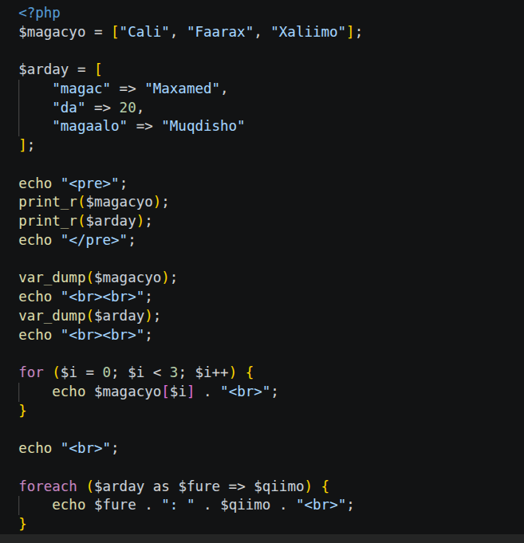
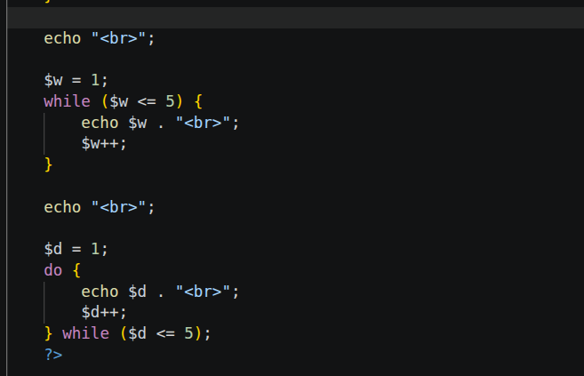

# Week2 practice

## Qaybta 1-aad: Arrays, Functions & Loops (for, foreach)

### Sharaxaadda Sawirka 1-aad:

1. **Arrays (Kaydinta Xogta badan):**
   * **Indexed Array (`$magacyo`):** Waa array ku shaqeysa tiro taxane ah (index) oo ka bilaabata `0`. Waxaa ku jira magacyada: `"Cali"`, `"Faarax"`, iyo `"Xaliimo"`.
   * **Associative Array (`$arday`):** Waa array isticmaasha qaabka `Key => Value` (fure iyo qiimo). Waxay kaydisay xogta ardayga sida: `"magac"`, `"da"`, iyo `"magaalo"`.

2. **Soo Bandhigista Array-da (Debugging/Display):**
   * **`<pre>` & `print_r()`:** Waxaa loo isticmaalay in qaab nadiif ah oo akhriskiisu sahlan yahay loogu soo saaro xogta array-da bogga internet-ka.
   * **`var_dump()`:** Waxay si faahfaahsan u muujisaa nooca xogta (data type), dhererka xogta, iyo qiimaha ku dhex jira array kasta.

3. **Loops-ka Qaybta 1:**
   * **`for` loop:** Waxaa loo isticmaalay in lagu dul wareego array-da indexed-ka ah (`$magacyo`). Waxay ka bilaabmaysaa `$i = 0` ilaa `$i < 3`, iyadoo mid mid usoo daabacaysa magacyada.
   * **`foreach` loop:** Waxaa si gaar ah loogu talagalay array-yada. Halkan waxaa loogu dul wareegay `$arday`, iyadoo la kala saaray furaha (`$fure`) iyo qiimihiisa (`$qiimo`), waxaana loo soo daabacay qaab ah: `magac: Maxamed`.

---

## Qaybta 2-aad: Loops (while, do...while)

### Sharaxaadda Sawirka 2-aad:

1. **`while` Loop:**
   * **Sida uu u shaqeynayo:** Waxaa la bilaabay doorsoome `$w = 1`. 
   * **Shardiga:** Loop-ku wuxuu shaqeynayaa inta uu shardigu yahay mid run ah (`$w <= 5`).
   * Tallaabo kasta, wuxuu daabacayaa lambarka isagoo ku daraya `1` (`$w++`). Marka uu gaaro `6`, shardiga ayaa been noqonaya wuuna joogsanayaa.

2. **`do...while` Loop:**
   * **Sida uu u shaqeynayo:** Wuxuu kaga duwan yahay loop-yada kale in koodhka ku jira qaybta `do` la fuliyo **ugu yaraan hal mar** ka hor inta aan shardiga la hubin.
   * Waxaa la bilaabay `$d = 1`, wuxuu daabacayaa lambarka, hal baa lagu darayaa (`$d++`), ka dibna waxa uu eegayaa shardiga `while ($d <= 5)`. Wuxuu soconayaa ilaa uu 5 ka gaaro.