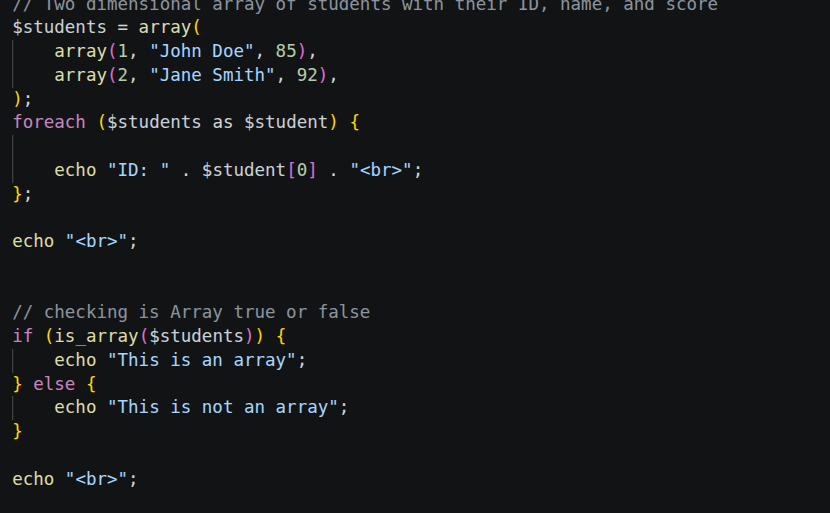
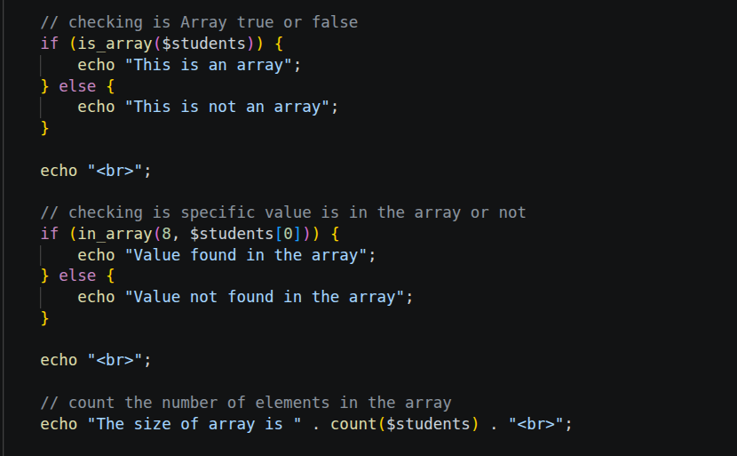

# Week 3 Practice

Faylkan `README` waxa uu sharxayaa koodhka PHP (PHP Code) ee lagu barto casharada usbuuca 3aad. Koodhkani waxa uu si gaar ah diiradda u saarayaa sida loo isticmaalo **Arrays** (gaar ahaan Two-dimensional arrays) iyo 'Functions'-ka muhiimka ah ee lagu maamulo arrays-ka ee ku jira luqadda PHP.

Hoos waxaa ku xusan sharaxaadda labada sawir ee koodhka xambaarsan.

---

## 1. Sharaxaadda Qeybta Koowaad (1.png)

Sawirkan koowaad wuxuu ina tusayaa aasaaska abuurista Array iyo sida loo hubiyo.

### Sida uu u shaqeynayo koodhkan (Logic):

1. **Abuurista Two-Dimensional Array:** 
   * Waxaa la abuuray variable lagu magacaabo `$students`. 
   * Variable-kan waa "Two-dimensional array" (Array gudahiisa ay ku jiraan Arrays kale). 
   * Array-ga weyn wuxuu hayaa xogta ardayda, halka Array-yada yaryar ee ku dhex jira ay hayaan xogta hal arday oo ka kooban saddex qeybood: ID (Tusaale: 1), Magac (Tusaale: "John Doe"), iyo Dhibco/Score (Tusaale: 85).

2. **Dhex-marista Array-ga (Foreach Loop):**
   * Waxaa la isticmaalay `foreach` loop si loogu dhex maro (iterate) dhammaan xogta ardayda ku jirta `$students`.
   * Loop-ka dhexdiisa, waxay soo daabacaysaa (echo) kaliya **ID-ga** arday kasta. Waxay tan ku sameyneysaa iyadoo u yeereysa index-ka eber `[0]` ee array-ga ardayga (`$student[0]`).

3. **Hubinta nooca xogta (is_array function):**
   * Waxaa la isticmaalay function-ka `is_array($students)` oo lagu dhex riday `if` statement.
   * Logic-ka halkan waa: In la hubiyo in variable-ka `$students` uu dhab ahaantii yahay Array iyo in kale. Maadaama uu yahay Array, shuruudda waa `true`, wuxuuna koodhku soo daabici doonaa fariinta ah: *"This is an array"*.

---

## 2. Sharaxaadda Qeybta Labaad (2.png)

Sawirkan labaad wuxuu sii wadayaa shaqadii koodhka, isagoo ina tusaya functions kale oo lagu baaro xogta ku jirta Array-ga dhexdiisa.

*(Fiiro gaar ah: Qeybta sare ee sawirkan waa isla koodhkii `is_array` ee sawirka hore, waxaan diiradda saaraynaa koodhka cusub ee hoose).*

### Sida uu u shaqeynayo koodhkan (Logic):

1. **Raadinta Qiimo Gaar ah (in_array function):**
   * Halkan waxaa la isticmaalay function-ka `in_array()`. Function-kani wuxuu raadiyaa in qiimo (value) go'an uu ku dhex jiro array la tilmaamay.
   * Logic-ka koodhku waa: `in_array(8, $students[0])`. Wuxuu weydiinayaa: "Miyuu lambarka **8** ku dhex jiraa xogta ardayga koowaad ee `$students[0]`?"
   * Xogta ardayga koowaad waa `(1, "John Doe", 85)`. Maadaama lambarka 8 uusan ku jirin xogtaas, natiijadu waxay noqonaysaa `false`. Sidaas darteed, koodhku wuxuu gudbi doonaa qeybta `else` wuxuuna soo daabici doonaa: *"Value not found in the array"*.

2. **Ogaanshaha Cabbirka Array-ga (count function):**
   * Ugu dambeyn, koodhku wuxuu adeegsanayaa function-ka `count($students)`.
   * Logic-kiisu waa inuu soo tiriyo inta element (qeybood) ee weyn ee ku dhex jira Array-ga `$students`. 
   * Maadaama ay ku jiraan xogta laba arday (laba arrays oo yaryar), function-ku wuxuu soo celin doonaa lambarka **2**, wuxuuna soo daabici doonaa: *"The size of array is 2"*.

